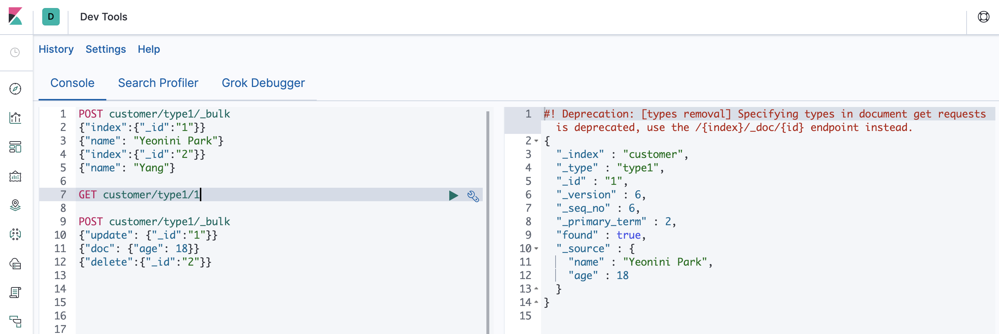
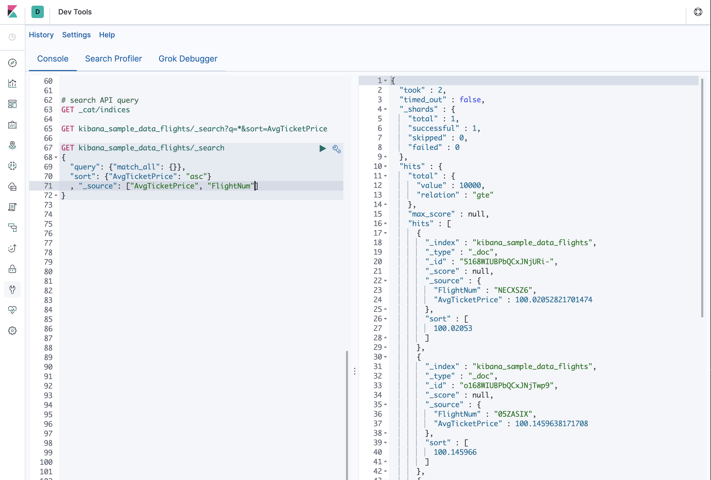
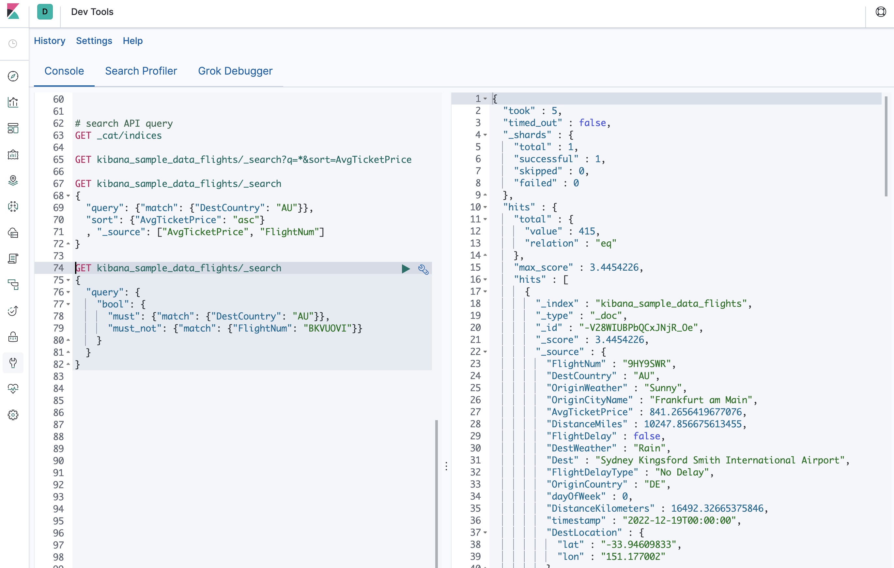

# Elasticsearch 배치 프로세스, 검색 API

### Batch Processing
  - _bulk 라는 API를 사용하여 작업을 일괄적으로 수행 가능
  - 이 기능은 최대한 적은 네트워크 왕복으로 가능한 빨리 여러 작업을 수행할 수 있는 효율적인 메커니즘 제공
  - HTTP Body 부분 끝에 반드시 엔터 추가 입력 필요
  - 중간에 실패하더라도 나머지 행동을 계속해서 처리
  - 대량 API가 반환되면 각 액션에 대한 상태가 전송 된 순서대로 제공되므로 특정 액션이 실패했는지 여부를 확인 가능
   

### 검색 API
  - 검색을 실행하는 기본적인 2가지 방법
    - REST 요청 "URI"를 통해 검색 매개 변수를 보내기
    - REST 요청 "본문"을 통해 검색 매개 변수를 보내기
  - 요청 본문 메서드를 사용하면 표현력을 높이고 더 쉽게 읽을 수 있는 JSON 형식으로 검색을 정의
  - 검색용 REST API는 _search 엔드 포인트에서 액세스


  - 예시
    ```
    // URI 방식
    GET /bank/_search?q=*&sort=account_number:asc&pretty

    // 본문 방식
    POST /bank/_search
    {
        "query": {"match_all": {}},
        "sort": [
            {"account_number": "asc"}
        ]
    }
    ```
    - bank 인덱스에서
    - q=* 는 Elasticsearch가 인덱스의 모든 문서와 일치하도록 지시
    - sort=account_number:asc는 각 문서의 account_number 필드를 사용하여 결과를 오름차순으로 정렬
    - pretty 매개 변수는 다시 Elasticsearch에게 예쁜 JSON 결과를 반환하도록 지시
  - 검색 API 결과 확인하기
    - took: Elasticsearch가 검색을 실행하는데 걸린 시간 (밀리 초)
    - timed_out: 검색 시간이 초과되었는지 여부를 알림
    - _shards: 검색된 파편의 수와 성공/실패한 파편의 수를 알림
    - hits: 검색 결과
    - hits.total: 검색 조건과 일치하는 총 문서 수
    - hits.hits: 검색 결과의 실제 배열 (기본값은 처음 10개)
    - hits.sort: 결과 정렬 키 (점수순 정렬 시 누락)

- Query DSL 쿼리 언어 소개
  - Elasticsearch는 쿼리를 실행하는데 사용할 수 있는 JSON 스타일 도메인 관련 언어를 제공
  ```
  POST /bank/_search
  {
      "query": {"match_all":{}},
      "size": 1  => 결과를 1개만 조회 (default: 10)
  }

  POST /bank/_search
  {
      "query": {"match_all":{}},
      "from": 10, => 결과의 10번째 항목부터 (default: 1)
      "size": 1
  }

  POST /bank/_search
  {
      "query": {"match_all":{}},
      "_source": ["account_number", "balance"] => 원하는 필드만 요청 가능
  }

  POST /bank/_search
  {
      "query": {"match_all":{"account_number": 20}} => account_number가 20인 것만 반환
  }

  POST /bank/_search
  {
      "query": {"match_all":{"address": "mill lane"}} => address가 mill 또는 lane과 일치하는 것만 반환
  }

  POST /bank/_search
  {
      "query": {"match_phrase":{"address": "mill lane"}} => address가 "mill lane"과 일치하는 것만 반환
  }
  ```
  
  