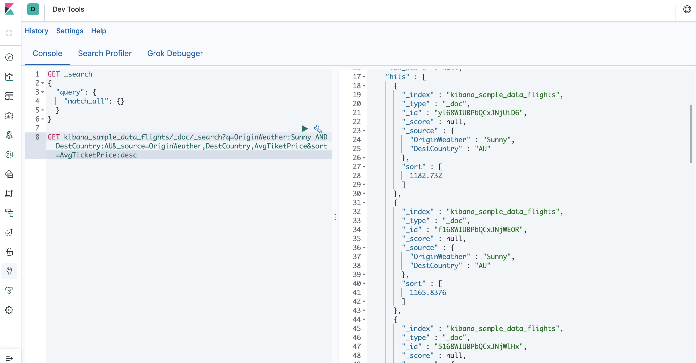

# Elasticsearch 배치 프로세스, 검색 API, 집계

### Batch Processing
  - _bulk 라는 API를 사용하여 작업을 일괄적으로 수행 가능
  - 이 기능은 최대한 적은 네트워크 왕복으로 가능한 빨리 여러 작업을 수행할 수 있는 효율적인 메커니즘 제공
  - HTTP Body 부분 끝에 반드시 엔터 추가 입력 필요
  - 중간에 실패하더라도 나머지 행동을 계속해서 처리
  - 대량 API가 반환되면 각 액션에 대한 상태가 전송 된 순서대로 제공되므로 특정 액션이 실패했는지 여부를 확인 가능
   

### 검색 API
  - 검색을 실행하는 기본적인 2가지 방법
    - REST 요청 "URI"를 통해 검색 매개 변수를 보내기
    - REST 요청 "본문"을 통해 검색 매개 변수를 보내기
  - 요청 본문 메서드를 사용하면 표현력을 높이고 더 쉽게 읽을 수 있는 JSON 형식으로 검색을 정의
  - 검색용 REST API는 _search 엔드 포인트에서 액세스


  - 예시
    ```
    // URI 방식
    GET /bank/_search?q=*&sort=account_number:asc&pretty

    // 본문 방식
    POST /bank/_search
    {
        "query": {"match_all": {}},
        "sort": [
            {"account_number": "asc"}
        ]
    }
    ```
    - bank 인덱스에서
    - q=* 는 Elasticsearch가 인덱스의 모든 문서와 일치하도록 지시
    - sort=account_number:asc는 각 문서의 account_number 필드를 사용하여 결과를 오름차순으로 정렬
    - pretty 매개 변수는 다시 Elasticsearch에게 예쁜 JSON 결과를 반환하도록 지시
  - 검색 API 결과 확인하기
    - took: Elasticsearch가 검색을 실행하는데 걸린 시간 (밀리 초)
    - timed_out: 검색 시간이 초과되었는지 여부를 알림
    - _shards: 검색된 파편의 수와 성공/실패한 파편의 수를 알림
    - hits: 검색 결과
    - hits.total: 검색 조건과 일치하는 총 문서 수
    - hits.hits: 검색 결과의 실제 배열 (기본값은 처음 10개)
    - hits.sort: 결과 정렬 키 (점수순 정렬 시 누락)

- Query DSL 쿼리 언어 소개
  - Elasticsearch는 쿼리를 실행하는데 사용할 수 있는 JSON 스타일 도메인 관련 언어를 제공
  ```
  POST /bank/_search
  {
      "query": {"match_all":{}},
      "size": 1  => 결과를 1개만 조회 (default: 10)
  }

  POST /bank/_search
  {
      "query": {"match_all":{}},
      "from": 10, => 결과의 10번째 항목부터 (default: 1)
      "size": 1
  }

  POST /bank/_search
  {
      "query": {"match_all":{}},
      "_source": ["account_number", "balance"] => 원하는 필드만 요청 가능
  }

  POST /bank/_search
  {
      "query": {"match_all":{"account_number": 20}} => account_number가 20인 것만 반환
  }

  POST /bank/_search
  {
      "query": {"match_all":{"address": "mill lane"}} => address가 mill 또는 lane과 일치하는 것만 반환
  }

  POST /bank/_search
  {
      "query": {"match_phrase":{"address": "mill lane"}} => address가 "mill lane"과 일치하는 것만 반환
  }
  ```
  
  

### 검색 _search API
  - Elasticsearch에서의 검색은 인덱스 또는 타입 단위로 수행
  - _search API 사용
  - 질의는 q 매개변수의 값으로 입력
  1) books 인덱스, book 타입에서 hamlet 검색 : `localhost:9200/books/book/_search?q=hamlet`
  2) books 인덱스에서 hamlet 검색 : `localhost:9200/books/_search?q=hamlet`
  3) 전체 인덱스에서 time 검색 : `localhost:9200/_search?q=time`
  - 특정 필드 검색
    - q 매개변수에 <필드명: 질의> 입력
    - 전체 인덱스의 title 필드에서 time 검색 : `/_search?q=title:time`
  - 다중 조건 검색
    - and와 or을 사용하여 다수의 조건을 검색
    - title 필드에서 time과 machine을 검색 : `/_search?q=titme:time AND machine`
  - explain
    - 점수 계산에 사용된 상세 값 출력
    - explain 매개변수를 사용해서 검색 처리 결과 표시 : `/_search?q=title:time&explain`
  - 요약된 전체 hit 수와 점수(score) 등의 메타 정보를 출력
    - _source(조회 결과값 나오는거)를 false로 설정하면 도큐먼트 출력 생략 : `/_search?q=title:time&_source=false`
  - 출력 결과애 표시할 필드를 지정
    - _source에 표시할 필드를 쉼표 , 로 구분하여 입력
    - title, author, category 필드만 출력 : `/_search?q=title:time&_source=title,author,category`
  - 검색 결과의 출력 순서 정렬
    - sort=필드명 형식 사용 (디폴트로 _score 값 기준)
    - 내림차순 정렬: sort=필드명:desc (디폴트로 asc(오름차순))
    - pages 필드를 기준으로 오름차순 정렬 : `/_search?q=author:jules&sort=pages`
    - pages 필드를 기준으로 내림차순 정렬 : `/_search?q=author:jules&sort=pages:desc`
  
  ```
  GET kibana_sample_data_flights/_doc/_search?q=OriginWeather:Sunny AND DestCountry:AU&_source=OriginWeather,DestCountry,AvgTiketPrice&sort=AvgTicketPrice:desc
  ```

### 집계
  - 집계는 데이터에서 통계를 그룹화하고 추출할 수 있는 기능을 제공
  - Elasticsearch에서는 조회수를 반환하는 검색을 수행할 수 있으며 동시에 한번의 응답으로 조회수와 별도로 집계된 결과도 반환
  - 이는 질의와 다중 집계를 실행하고 간결하고 단순화된 API를 사용하여 네트워크 라운드 트립을 피하면서 한번의 작업으로 결과를 모두 얻을 수 있다는 점에서 매우 강력하고 효율적 (대신 DB에 부하가 심함)
  - 예제1) 모든 account를 state별로 그룹화한 다음 count 내림차순으로 정렬된 상위 10개(기본) 상태를 반환 (기본값)
    - Size=0은 일반 결과를 삭제하여 집계된 결과만 표시
    ```
    GET /bank/_search
    {
      "size": 0,
      "aggs": {
        "group_by_state":{
          "terms": {"field": "state.keyword"}
        }
      }
    }
    ```
    - 각 state의 평균 밸런스 집계
    ```
    GET /bank/_searcj
    {
      "size": 0,
      "aggs": {
        "group_by_state":{
          "terms": {"field": "state.keyword"},
          "aggs":{
            "average_balance":{
              "avg":{"field": "balance"}
            }
          }
        }
      }
    }
    ```
  - 예제2) 나이별로 데이터를 그룹화한 뒤 성별로 밸런스 집계
    ```
    GET /bank/_search
    {
      "size": 0,
      "aggs":{
        "group_by_age": {
          "range": {
            "field": "age",
            "ranges": [
              {"from": 20, "to": 30},
              {"from": 30, "to": 40},
              {"from": 40, "to": 50},
            ]
          },
          "aggs": {
            "group_by_gender":{
              "terms": {"field": "gender.keyword"},
              "aggs": {"average_balance": {"avg": {"field": "balance"}}}
            }
          }
        }
      }
    }
    ```