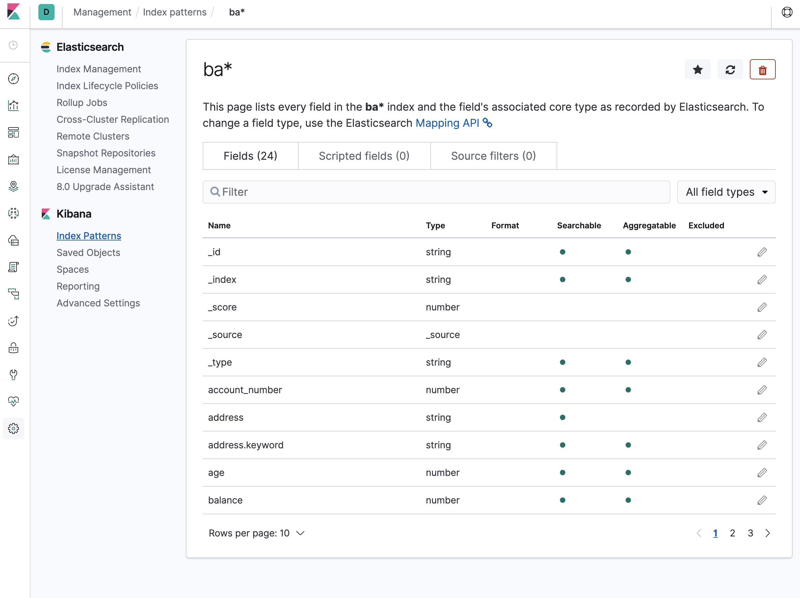

# Kibana 시각화

### Kibana 소개
- Kibana는 Elasticsearch와 함께 작동하도록 설계된 오픈소스 분석 및 시각화 플랫폼
- Kibana는 Elasticsearch 와 버전을 맞춰서 사용해야 함
- Kibana를 사용하여 Elasticsearch 인덱스에 저장된 데이터를 검색, 보기 및 상호 작용 함
- 고급 데이터 분석을 쉽게하고 다양한 차트, 테이블 및 맵에서 데이터 시각화 가능
- 브라우저 기반의 인터페이스로 실시간으로 Elasticsearch 쿼리의 변경 사항을 동적 대시보드를 신속하게 만들고 공유
- 기본 포트는 5601
- localhost:5601/status 하면 Kibana 서버의 상태 페이지 접근 가능 (서버의 자원 사용 정보, 설치된 플러그인 확인 가능)
- Kibana에 처음 액세스할 경우 아래 절차 진행
  - 색인 중 하나 이상의 이름과 일치하는 Index 패턴을 정의하라는 메시지가 표시
  - 관티 앱에서 언제든지 색인 패턴을 추가
- 기본적으로 Kibana는 localhost에서 실행중인 Elasticsearch 인스턴스에 연결
- 다른 Elasticsearch 인스턴스에 연결하려면 kibana.yaml 구성파일에서 Elasticsearch URL을 수정 후 재시작
  

### Kibana Index Pattern 추가하기
- 브라우저에서 Kibana 접속 > Management > Kibana Index Patters > Create index pattern 클릭
- 원하는 Index 검색하여 선택
- Time filter를 선택 (Time filter는 데이터 분석 시에 시계열 데이터로 시간에 따라 분석할 수 있게 함)
  
- 처음 Index Pattern 추가 이후에도 로그 수집을 하면 자동으로 Index Pattern에 들어가지 않으므로 Create 해주면 됨

### Loading Sample Data
- 데이터를 로드하기 전에 매핑을 먼저 수행 
- 매핑을 수행하지 않은 경우에는 임의의 데이터 형태로 매핑됨
- 매핑이란 인덱스의 문서를 논리적 그룹으로 나누고 필드의 검색 가능성, 토큰화 여부, 별도의 단어로 분리 여부, 타입과 같은 필드의 특성을 지정
- 벌크 데이터를 사용하여 Elasticsearch에 샘플 데이터 로드 
- GET /_cat/indices?v 해서 데이터 잘 로드 되었는지 확인 가능, 이후 Index Pattern 추가
- [https://www.elastic.co/guide/en/kibana/7.2/tutorial-load-dataset.html ](https://www.elastic.co/guide/en/kibana/7.2/tutorial-build-dashboard.html#tutorial-load-sample-data) 접속 후 아래 다운로드
```
curl -O https://download.elastic.co/demos/kibana/gettingstarted/8.x/shakespeare.json
curl -O https://download.elastic.co/demos/kibana/gettingstarted/8.x/accounts.zip
curl -O https://download.elastic.co/demos/kibana/gettingstarted/8.x/logs.jsonl.gz
```
1) 매핑을 통해 틀을 먼저 생성
  - PUT을 통해 매핑하는데 매핑 내용을 Json으로 넘겨줘야 함
  

2) 실제 데이터 로드 (elasticsearch의 default pwd는 'changeme')
   - 아래 명령어 터미널에서 수행
```
curl -u elastic -H 'Content-Type: application/x-ndjson' -XPOST 'localhost:9200/bank/_bulk?pretty' --data-binary @accounts.json
curl -u elastic -H 'Content-Type: application/x-ndjson' -XPOST 'localhost:9200/shakespeare/_bulk?pretty' --data-binary @shakespeare.json
curl -u elastic -H 'Content-Type: application/x-ndjson' -XPOST 'localhost:9200/_bulk?pretty' --data-binary @logs.jsonl
```
   - Index Management에서 데이터 잘 들어왔는지 확인 가능 (Health에 Yellow인 이유는 아직 sharding 안끝나서 그런것)
    

3) Index Pattern 생성 
   - 이전에 했던 방식대로 index pattern 생성
   - logstash는 Time Filter 선택해줘야 함, utc_time 선택
   - Time Filter를 고를 때 보통 @ 붙은걸 선택함, 보통 @ 붙은게 logstash 수집될 때 찍힌 시간
   - 그런데 만약 데이터를 실시간이 아니라 한번에 넣게 되면 @ 붙은 시간이 데이터 넣을 때 시간이 되므로 로그가 생성된 시간과 불일치 할 수 있음
    
   - geoponint 같은 Type이 잘 매핑되었는지 확인 필요, 그래야 나중에 Coordinate Map 그릴 때 그려짐, 단순 float 과 같은 형태면 안됨
    

### 데이터 시각화 하기